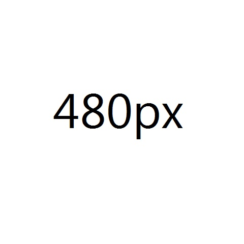

Srcset Polyfill
===============

An image srcset polyfill that provides fallback behaviour for browsers that do not support the srcset attribute.

Supports the current syntax as defined below.   

http://www.whatwg.org/specs/web-apps/current-work/multipage/embedded-content-1.html#attr-img-srcset

http://lists.whatwg.org/pipermail/whatwg-whatwg.org/2012-May/035746.html

Markup
======

``` html
    
```

Support
==========
Browser support is IE8+ and all other modern browsers.